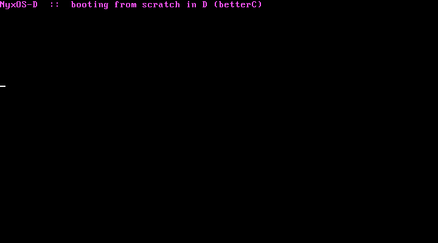

<div align="center">
  
</div>

<p align="center"><strong>NyxOS, rebuilt from scratch in D — a freestanding Multiboot kernel that boots on bare metal</strong></p>

<p align="center">
  
  &nbsp;
  
  &nbsp;
  
  &nbsp;
  <a href="https://github.com/nyxos-dev/nyx-os"></a>
</p>

---

## About

Part of the **[NyxOS](https://github.com/nyxos-dev/nyx-os) family** — the same OS, rebuilt from zero in a different language each time. This is the **D** cut, built in D's `-betterC` mode: no garbage collector, no `TypeInfo`, no D runtime. A small Multiboot assembly stub calls `kmain()`, and D writes its banner straight to VGA text memory.

<div align="center">
  
  <p><em>NyxOS-D booting in QEMU — D's -betterC mode writing to the VGA text buffer</em></p>
</div>

**Why D:** `-betterC` gives you D's expressiveness with no runtime or GC — ideal for a kernel. Proven in the wild by PowerNex.

## Build & run

Needs `ldc2`, `nasm`, `ld`, and `qemu`. (SIMD is disabled via `-mattr=-sse,-sse2,-mmx` — a bare kernel has no SSE enabled, so LLVM must not auto-vectorize.)

```bash
make        # -> nyxos-d.elf  (verified Multiboot with grub-file)
make run    # boot it in QEMU
```

## Layout

- `boot.asm` — Multiboot header + entry stub that calls `kmain`
- `kernel.d` — the freestanding D kernel (VGA console)
- `linker.ld` — links the kernel at 1 MiB, Multiboot header first
- `Makefile` — build and boot

## Status

Early — it boots and paints the screen. Next up: a GDT, interrupts, and a VGA console `struct`.
